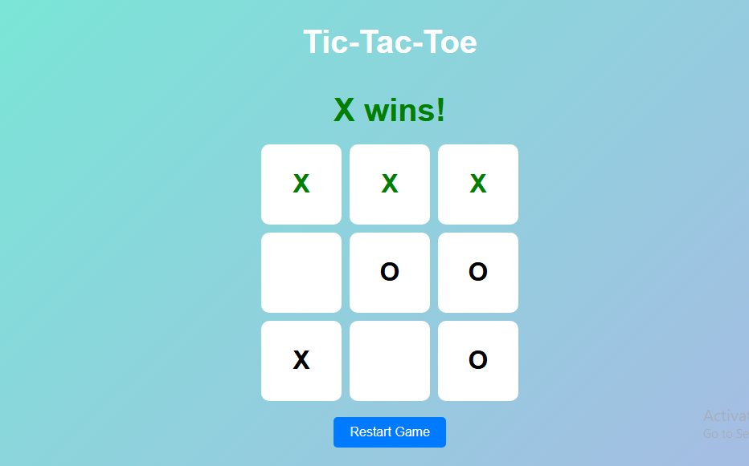

# 🎮 JavaScript Tic Tac Toe

A simple and fun **Tic Tac Toe game** built using **HTML, CSS, and JavaScript**. The project focuses on clean UI, basic game logic, and sound effects to make the gameplay engaging.

---

## ✨ Features

* Classic **Tic Tac Toe (X vs O)** gameplay
* Interactive UI with hover & click effects
* Win detection logic
* Sound effects for background music and winning
* Reset / restart game functionality
* Fully responsive and browser-friendly

---

## 🛠️ Tech Stack

* **HTML5** – Structure
* **CSS3** – Styling & layout
* **JavaScript** – Game logic

---

## 📂 Project Structure

```
JS tic-tac-toe/
│
├── index.html        # Main HTML file
├── style.css         # Styling
├── script.js         # Game logic
├── sound/
│   ├── music.wav     # Background music
│   └── winner.wav    # Win sound
└── README.md
```

---

## ▶️ How to Run the Project

1. Download or clone the repository

   git clone https://github.com/usama247550/tic-tac-toe-js.git
   
3. Open the project folder
4. Double-click **index.html** or open it in any modern browser

That’s it — enjoy the game! 🎉

---

## 🧠 Game Logic Overview

* Each cell listens for a click event
* Players alternate between **X** and **O**
* Predefined winning combinations are checked after every move
* On win, a sound is played and the game stops
* Game can be restarted without refreshing the page

---

## 🚀 Future Improvements

* Add score tracking
* Player vs Computer (AI mode)
* Difficulty levels
* Mobile-first UI improvements

---

## 📸 Screenshots

<table>
   <tr>
      <td></td>
   </tr>
</table>

---

👨‍💻 **Author**  

Usama
MERN Stack Developer

GitHub: https://github.com/usama247550

LinkedIn: https://www.linkedin.com/in/usama-javed-112186320

⭐ **Show Your Support**  

If you like this project, give it a ⭐ on GitHub!

